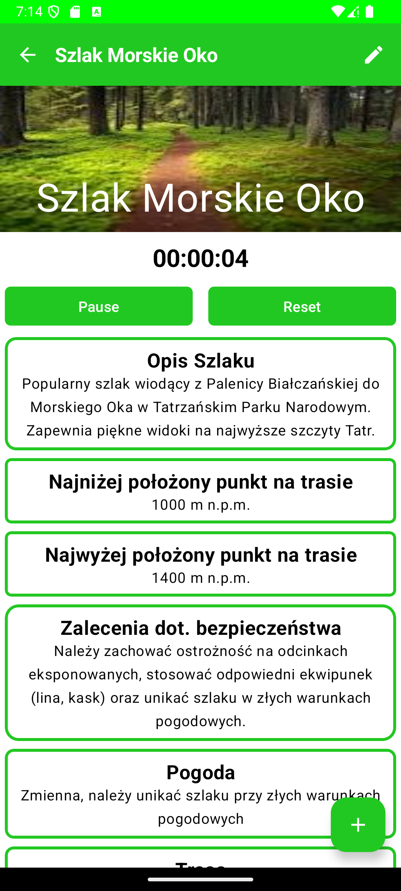

# Android Hiking Trails App

[](https://kotlinlang.org)
[](https://developer.android.com/jetpack/compose)

Prosta aplikacja na Androida do przeglądania informacji o szlakach turystycznych, zbudowana przy użyciu Kotlin i Jetpack Compose.

## Opis

Aplikacja "Szlaki Turystyczne" pozwala użytkownikom przeglądać listę szlaków wraz z podstawowymi informacjami oraz wyświetlać szczegółowe dane na temat wybranego szlaku. Zawiera również prosty stoper do mierzenia czasu wędrówki.

## Zrzuty ekranu

|                     Widok listy                     | Widok szczegółów                               |
|:---------------------------------------------------:| :----------------------------------------------: |
|  |  |

## Główne funkcjonalności

*   **Przeglądanie listy szlaków:** Wyświetlanie listy dostępnych szlaków turystycznych.
*   **Podstawowe informacje:** Dla każdego szlaku na liście widoczne są:
    *   Zdjęcie poglądowe
    *   Nazwa szlaku
    *   Poziom trudności (np. Łatwy, Średni, Trudny)
    *   Długość trasy (w km)
    *   Szacowany czas przejścia
*   **Szczegóły szlaku:** Po wybraniu szlaku z listy, użytkownik widzi ekran szczegółowy zawierający:
    *   Duże zdjęcie nagłówkowe
    *   Nazwę szlaku
    *   Pełny opis trasy
    *   Najniższy i najwyższy punkt na trasie (wysokość n.p.m.)
    *   Zalecenia dotyczące bezpieczeństwa
    *   Informacje o pogodzie (lub zalecenia z nią związane)
*   **Stoper:** Wbudowany prosty stoper z funkcjami Start/Reset do mierzenia czasu aktywności na szlaku.
*
## Technologie

*   **Język:** Kotlin
*   **Interfejs użytkownika:** Jetpack Compose
*   **Nawigacja:** Jetpack Navigation Component (Compose)
*   **Zarządzanie stanem:** ViewModel
*   **(Opcjonalnie) Baza danych:** Room Persistence Library

## Jak zacząć

1.  Sklonuj repozytorium:
    ```bash
    git clone https://github.com/HubertLuszkiewicz/HikingTrails.git
    ```
2.  Otwórz projekt w Android Studio.
3.  Poczekaj na synchronizację Gradle.
4.  Zbuduj i uruchom aplikację na emulatorze lub fizycznym urządzeniu.